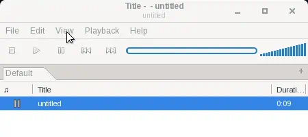
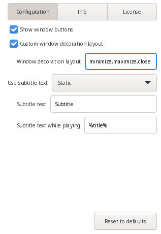

Replaces the title bar with a GTK3 header bar CSD-style.
Widgets can be added to the two sides of the header bar.

## Features

- Customisable/optional window decorations (icon and window buttons).
- Title is fetched from the main window.
- Customisable/optional subtitle using title formatting.
- API.

## Demo

The plugin in the default GTK3 theme:


Shows the header bar, with its title and subtitle, proceeding with a look in Design Mode, pasting widgets and then stopping playbback to showcase the dynamic subtitle.


The plugin preferences pane.

## Build

```
make gtk3
```
